数据预处理&可视化


```python
import os
import pandas as pd
import numpy as np
import matplotlib.pyplot as plt #导入matplotlib.pyplot画图模块
import seaborn as sns
import matplotlib.font_manager as mfm  # 字体
font_path = r"/Users/mac/Library/Fonts/字体管家方萌简（非商业使用）v1.1.ttf"
prop = mfm.FontProperties(fname = font_path)
```

# 1.读入数据


```python
os.chdir("/Users/mac/Desktop/快乐研一/数据挖掘/留学推荐code&data/留学数据code&data/")
descriptive = pd.read_csv('./data/Data_Cleaning.csv') # 读取原始数据
print(descriptive.shape)
descriptive.head()
```

    (16215, 32)


<div>
<style scoped>
    .dataframe tbody tr th:only-of-type {
        vertical-align: middle;
    }

    .dataframe tbody tr th {
        vertical-align: top;
    }

    .dataframe thead th {
        text-align: right;
    }
</style>
<table border="1" class="dataframe">
  <thead>
    <tr style="text-align: right;">
      <th></th>
      <th>index_origin</th>
      <th>author</th>
      <th>time</th>
      <th>toefl</th>
      <th>gre_total</th>
      <th>gre_v</th>
      <th>gre_q</th>
      <th>gre_aw</th>
      <th>district</th>
      <th>season</th>
      <th>...</th>
      <th>major_before</th>
      <th>cross</th>
      <th>gpa_measure</th>
      <th>rl</th>
      <th>intern</th>
      <th>research</th>
      <th>paper</th>
      <th>first</th>
      <th>sci</th>
      <th>exchange</th>
    </tr>
  </thead>
  <tbody>
    <tr>
      <th>0</th>
      <td>10001</td>
      <td>leucocyte</td>
      <td>17</td>
      <td>92</td>
      <td>319</td>
      <td>149</td>
      <td>170</td>
      <td>3</td>
      <td>美国</td>
      <td>Fall</td>
      <td>...</td>
      <td>CS</td>
      <td>1</td>
      <td>4.0</td>
      <td>0</td>
      <td>0</td>
      <td>0</td>
      <td>0</td>
      <td>0</td>
      <td>0</td>
      <td>0</td>
    </tr>
    <tr>
      <th>1</th>
      <td>10003</td>
      <td>yycenty</td>
      <td>17</td>
      <td>96</td>
      <td>327</td>
      <td>NaN</td>
      <td>NaN</td>
      <td>3.5</td>
      <td>美国</td>
      <td>Fall</td>
      <td>...</td>
      <td>环工</td>
      <td>0</td>
      <td>4.0</td>
      <td>0</td>
      <td>0</td>
      <td>0</td>
      <td>0</td>
      <td>0</td>
      <td>0</td>
      <td>0</td>
    </tr>
    <tr>
      <th>2</th>
      <td>10004</td>
      <td>JOJOJie</td>
      <td>17</td>
      <td>101</td>
      <td>322</td>
      <td>NaN</td>
      <td>NaN</td>
      <td>3.5</td>
      <td>美国</td>
      <td>Fall</td>
      <td>...</td>
      <td>EE</td>
      <td>0</td>
      <td>100.0</td>
      <td>0</td>
      <td>0</td>
      <td>0</td>
      <td>1</td>
      <td>1</td>
      <td>1</td>
      <td>0</td>
    </tr>
    <tr>
      <th>3</th>
      <td>10008</td>
      <td>smallyeye</td>
      <td>17</td>
      <td>103</td>
      <td>325</td>
      <td>NaN</td>
      <td>NaN</td>
      <td>3.5</td>
      <td>美国</td>
      <td>Fall</td>
      <td>...</td>
      <td>能源与动力工程</td>
      <td>0</td>
      <td>100.0</td>
      <td>0</td>
      <td>0</td>
      <td>0</td>
      <td>0</td>
      <td>0</td>
      <td>0</td>
      <td>0</td>
    </tr>
    <tr>
      <th>4</th>
      <td>10013</td>
      <td>wannagotousa</td>
      <td>17</td>
      <td>108</td>
      <td>328</td>
      <td>NaN</td>
      <td>NaN</td>
      <td>3.5</td>
      <td>美国</td>
      <td>Fall</td>
      <td>...</td>
      <td>电信工程</td>
      <td>0</td>
      <td>100.0</td>
      <td>0</td>
      <td>1</td>
      <td>0</td>
      <td>0</td>
      <td>0</td>
      <td>0</td>
      <td>0</td>
    </tr>
  </tbody>
</table>
<p>5 rows × 32 columns</p>
</div>


# 2.因变量


```python
# 2.因变量调整
# 调整命名
descriptive['offertype'] = descriptive['offertype'].replace('Rej','Rejected')
descriptive['offertype'] = descriptive['offertype'].replace(['AD小奖','Offer','AD无奖'],'Admitted')  # 不考虑奖学金，均归入“Admitted“（录取）
descriptive = descriptive.dropna(subset=['offertype'])  # 删去缺失录取结果的样本
print(descriptive['offertype'].unique())
# 为简化后续分信息，删掉录取结果为WaitingList的样本
descriptive = descriptive[descriptive['offertype'] != 'WaitingList']
descriptive['offertype'].value_counts()
```

    ['Rejected' 'Admitted' 'WaitingList']


    Admitted    11370
    Rejected     4538
    Name: offertype, dtype: int64


# 3.申请学位


```python
# 饼图
descriptive['type'].unique()  
plt.figure(figsize=(5,5))
plt.pie(list(descriptive['type'].value_counts()), 
        explode = [0.01,0.01,0.01], 
        labels = ['MS', 'PhD', 'mixed'],
        autopct='%1.1f%%')
plt.title('申请学位类型',fontproperties=prop, fontsize=20)
plt.show()
plt.close()
# 不同学位录取率
admit_counts=pd.crosstab(descriptive['type'],descriptive['offertype'])
admit_pcts=admit_counts.div(admit_counts.sum(1),axis=0)
print(admit_pcts)
admit_pcts.plot.bar(cmap = "Set3")
plt.title('申请学位类型与录取率',fontproperties=prop, fontsize=20)
plt.show()
plt.close()
```


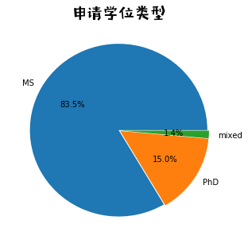


    offertype  Admitted  Rejected
    type                         
    MS         0.713759  0.286241
    PhD        0.718045  0.281955
    混合         0.736842  0.263158


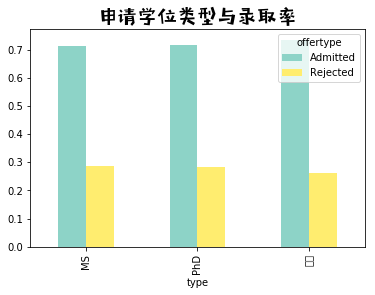


# 4.申请学校


```python
descriptive['college_apply']=descriptive['college_apply'].replace(['Texas A','M University'],'Texas A&M University')
descriptive['college_apply']=descriptive['college_apply'].replace(['Washington University in St','Louis'],'Washington University in St. Louis')
```

## 4.1 统一学校名称


```python
suoxie=pd.read_table('./data/所有大学&地区/美国大学缩写汇总.txt',sep=' ')
college_low=descriptive['college_apply'].str.lower()
suoxie_low=suoxie['ysuoxie'].str.lower()
college_apply_new=[]
for i in college_low:
    count2 = 0
    for j in suoxie_low :
        if str(j) in str(i):
            count2 += 1
            college_apply_new.append(suoxie[suoxie['ysuoxie'].str.lower()==str(j)]['yquancheng'].values[0])
            break
    if not count2:
        college_apply_new.append(i)
print(len(college_apply_new))
descriptive['College_apply_new'] = college_apply_new    ##统一名称后的新变量
```

    15344


## 4.2 热门申请学校


```python
# 找出十大热门学校
top10_college_apply=descriptive['College_apply_new'].value_counts()[:10].index.tolist()
descriptive_top10=descriptive.loc[descriptive['College_apply_new'].isin(top10_college_apply)]
print(top10_college_apply)
# 图表展示
top10_counts = pd.crosstab(descriptive_top10['College_apply_new'],descriptive_top10['offertype'])
top10_counts.plot.bar(stacked = True,cmap = "Set3")
plt.title('热门十所学校录取情况',fontproperties=prop, fontsize=20)
plt.show()
plt.close()
```

    ['University of Chicago', 'Carnegie Mellon University', 'Ithaca College', 'University of Southern California', 'Northeastern University', 'Liberty University', 'Duke University', 'University of Pennsylvania', 'Indiana University Bloomington', 'University of Northern Iowa (was Iowa Teachers)']


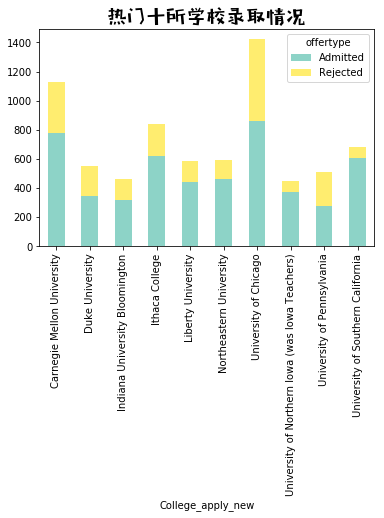


## 4.3 各学校录取率


```python
# 4.3 各学校录取率
# 排序并提取申请人数较多的百所学校 
top100_college_apply=descriptive['College_apply_new'].value_counts()[:100].index.tolist()
descriptive=descriptive.loc[descriptive['College_apply_new'].isin(top100_college_apply)]
counts_100=pd.crosstab(descriptive['College_apply_new'],descriptive['offertype'])
counts_pcts=counts_100.div(counts_100.sum(1),axis=0)
plt.hist(counts_pcts['Admitted'],color = "gold",bins=15)
plt.title('学校录取率直方图',fontproperties=prop, fontsize=20)
plt.show()
plt.close()

# 录取率最低和最高的
print(counts_pcts[counts_pcts['Admitted']==max(counts_pcts['Admitted'])])
print(counts_pcts[counts_pcts['Admitted']==min(counts_pcts['Admitted'])])
```


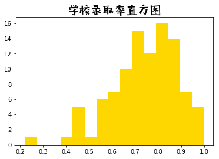


    offertype                           Admitted  Rejected
    College_apply_new                                     
    New Jersey Institute of Technology       1.0       0.0
    Rochester Institute of Technology        1.0       0.0
    University of Alabama                    1.0       0.0
    University of Utah                       1.0       0.0
    ethz                                     1.0       0.0
    offertype             Admitted  Rejected
    College_apply_new                       
    Princeton University      0.22      0.78


## 4.4. 申请学校排名


```python
## 按学校名称匹配大学排名
universities = pd.read_table('./data/QS大学排名前百（美国）.txt',header = None)  ## 读入QS世界大学排名
universities = [x[0] for x in universities.values]
top10university = descriptive['College_apply_new'].isin(universities[:6])
top10_50university = descriptive['College_apply_new'].isin(universities[6:])
ranktmp = top10university * 2+ top10_50university
collegeRank,collegeranktop50 = [],[]
for rk in ranktmp:
    if rk > 0:
        collegeranktop50.append('Top50')
        if rk == 2:
            collegeRank.append('Top10')
        elif rk == 1:
            collegeRank.append('Top10_50')
    else:
        collegeranktop50.append('Others')
        collegeRank.append('Others')
descriptive['CollegeRank']=collegeRank  ##并入原数据
descriptive['CollegeRankTop50']=collegeranktop50  ##并入原数据
print(descriptive['CollegeRank'].value_counts())
```

    Others      9026
    Top10_50    4586
    Top10       1732
    Name: CollegeRank, dtype: int64


# 5.原始学校


```python
## 读入学校排名数据
universities2=pd.read_table('./data/QS大学排名前500（中国）.txt', header = None, sep='\t', error_bad_lines = False)
a100=universities2.values.tolist()[:10]
b100=[i for item in a100 for i in item]
## 匹配学校
top100university=[]
for i in descriptive['college_before']:
    count3 = 0
    for j in b100:
        if str(i) in str(j):
            count3 += 1
            top100university.append('Top100')
        break
    if not count3:
        top100university.append('Others')
print(len(top100university))
descriptive['Before_CollegeRank']=top100university
### 图表展示
top100_counts = pd.crosstab([descriptive['CollegeRank'],descriptive['Before_CollegeRank']],descriptive['offertype'])
top100_pcts=top100_counts.div(top100_counts.sum(1),axis=0)
top100_pcts1 = pd.DataFrame(top100_pcts)
rownames = top100_pcts1._stat_axis.values.tolist()
top100_pcts1['CollegeRank'] = [x[0] for x in rownames]
top100_pcts1['Before_CollegeRank'] = [x[1] for x in rownames]
top100_pcts1 = top100_pcts1.drop('Rejected', axis = 1)
# 宽-长
top100_pcts2 = top100_pcts1.melt(
        id_vars=["CollegeRank","Before_CollegeRank"],   #要保留的主字段
        value_name="ratio"                  # 拉长的度量值名称
        )
print(top100_pcts2)
sns.catplot(x='Before_CollegeRank', y='ratio', hue = 'CollegeRank',
               kind='bar', data=top100_pcts2, palette = "Set3")
plt.title('原始学校 x 申请学校 - 录取率',fontproperties=prop, fontsize=20)
plt.show()
plt.close()
```

    15344
      CollegeRank Before_CollegeRank offertype     ratio
    0      Others             Others  Admitted  0.768595
    1      Others             Top100  Admitted  0.754938
    2       Top10             Others  Admitted  0.562833
    3       Top10             Top100  Admitted  0.591885
    4    Top10_50             Others  Admitted  0.663664
    5    Top10_50             Top100  Admitted  0.669586


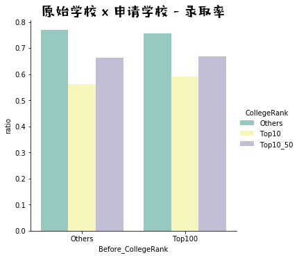


# 6.专业


```python
def matchmajor(x):
    if x in ["统计","统计学","Statistics","STAT","Stat","stat","Biostat","应用数学","数学","math","Math/Stat","概率统计","应数","数学与应用数学"]:
        return "Stat/Biostat"
    if x in ["软件工程","se","Software Engineering"]:
        return "SE"
    if x in ["cs", "计算机科学","计算机","信息与计算科学","计算机科学与技术","Computer Science"]:
        return "CS"
    if x in ["材料","material","MSE","材料科学与工程","Material Physics"]:
        return "Material"
    if x in ["通信工程","信息工程","电子信息工程","ee","电子科学与技术","微电子","ECE","光电"]:
        return "EE"
    if x in ["Automation","自动化","工业工程","IE",'自动化控制',"电气工程及其自动化"]:
        return "IEOR"
    if x in ["金融数学","金融","金融工程","MFE","Fin","FinMath","fiannce","精算","数理金融"]:
        return "MFE/Fin/FinMath"
    if x in ["机械","机械工程",'热能与动力工程',"测控"]:
        return "ME"
    if x in ["物理","力学","physics","应用物理"]:
        return "Physics"
    if x in ["信息管理与信息系统"]:
        return "MIS"
    return x
```

## 6.1 十大热门原始专业


```python
# 6.1 十大热门原始专业
major_before = list(descriptive['major_before'].values)
major_before = [matchmajor(x) for x in major_before]
descriptive['major_before'] = major_before
top10majorbefore = descriptive['major_before'].value_counts()[:10]
print(top10majorbefore)
top10mj_bf = top10majorbefore._stat_axis.values.tolist()
top10mj_bf_des = descriptive[(descriptive['major_before'].isin(top10mj_bf))]
# 原始专业 x 申请学位 -- 人数
mj_bf_top = pd.crosstab(top10mj_bf_des['major_before'],top10mj_bf_des['type'])
mj_bf_top = mj_bf_top.drop('混合', axis = 1)  # 删掉混合
mj_bf_top.plot.barh(stacked = True, cmap = "Set3")  # 画图
plt.title('原始专业 x 申请学位 -- 人数',fontproperties=prop, fontsize=20)
plt.show()
plt.close()
```

    EE                 2935
    CS                 1820
    SE                 1002
    Stat/Biostat        853
    IEOR                727
    ME                  456
    Material            286
    MIS                 236
    Physics             231
    MFE/Fin/FinMath     146
    Name: major_before, dtype: int64


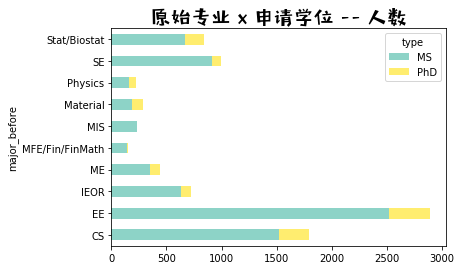


## 6.2 热门申请专业


```python
## 6.2 热门申请专业
top10mj_ap = descriptive['major_apply'].value_counts()[:11]
print(top10mj_ap)
top10mj_ap = top10mj_ap._stat_axis.values.tolist()
top10mj_ap.pop(-4)  # 删掉others
top10mj_ap_des = descriptive[(descriptive['major_apply'].isin(top10mj_ap))]
# 申请专业 X 学位 -- 人数
mj_ap_top =  pd.crosstab(top10mj_ap_des['major_apply'],top10mj_ap_des['type'])
mj_ap_top = mj_ap_top.drop('混合', axis = 1)  # 删掉混合
mj_ap_top.plot.barh(stacked = True, cmap = "Set3")  # 画图
plt.title('申请专业 X 学位 -- 人数',fontproperties=prop, fontsize=20)
plt.show()
plt.close()
```

    CS                 5160
    EE                 3548
    Stat/Biostat       1549
    ME                  907
    MIS                 692
    CE                  477
    Material            405
    Other               391
    IEOR                375
    MFE/Fin/FinMath     338
    CivilEng            323
    Name: major_apply, dtype: int64


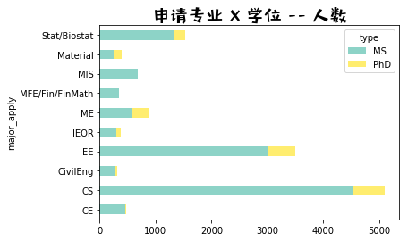


## 6.3 转专业矩阵


```python
# 原始 + 申请的总的10大专业
major_before = list(descriptive['major_before'].values)
major_apply = list(descriptive['major_apply'].values)
majors = major_before + major_apply
TOP10major = pd.value_counts(majors)[:10]
TOP10major = TOP10major._stat_axis.values.tolist()
print(TOP10major)
# 取出申请或者原始为热门专业的数据
major_bf_ap = [(major_before[i] in TOP10major) and (major_apply[i] in TOP10major) for i in range(len(major_apply))]
major_des = descriptive[(major_bf_ap)]
# apply矩阵：
major_ap_matrix = pd.get_dummies(major_des.major_apply, prefix="apply")   # 全部生成虚拟变量，列名前面加上type
major_ap_matrix.insert(0, "apply_SE", 0, allow_duplicates=False)
major_ap_matrix2 = major_ap_matrix.reindex(["apply_"+x for x in TOP10major],axis = 1)
major_ap_matrix2.columns
# bf矩阵
major_bf_matrix = pd.get_dummies(major_des.major_before, prefix="before")   # 全部生成虚拟变量，列名前面加上type
major_bf_matrix2 = major_bf_matrix.reindex(["before_"+x for x in TOP10major],axis = 1)
major_bf_matrix2.columns
# 转移矩阵
major_ap_matrix = np.array(major_ap_matrix2)
major_bf_matrix = np.array(major_bf_matrix2)
TOP10major_matrix = np.dot(major_bf_matrix.T,major_ap_matrix)
TOP10major_matrixPct = TOP10major_matrix / np.sum(TOP10major_matrix, axis = 1, keepdims = True)
print(np.round(TOP10major_matrixPct,2))
# 矩阵图
plt.figure(figsize=(7,7))
sns.heatmap(pd.DataFrame(np.round(TOP10major_matrixPct,2), 
                         columns = TOP10major,
                         index = TOP10major), 
                annot=True, vmax=1,vmin = 0, 
                xticklabels= True, yticklabels= True, 
                square=True, cmap = 'Purples')
plt.xlabel('申请专业',fontproperties=prop, fontsize=20)
plt.ylabel('原始专业',fontproperties=prop, fontsize=20)
plt.show()
plt.close()
```

    ['CS', 'EE', 'Stat/Biostat', 'ME', 'IEOR', 'SE', 'MIS', 'Material', 'CE', 'MFE/Fin/FinMath']
    [[0.92 0.01 0.01 0.   0.01 0.   0.04 0.   0.01 0.01]
     [0.26 0.62 0.01 0.   0.01 0.   0.02 0.   0.08 0.  ]
     [0.06 0.   0.82 0.   0.03 0.   0.01 0.   0.   0.09]
     [0.12 0.13 0.   0.67 0.03 0.   0.   0.   0.03 0.  ]
     [0.24 0.46 0.01 0.04 0.14 0.   0.02 0.   0.08 0.01]
     [0.94 0.01 0.   0.   0.   0.   0.04 0.   0.01 0.  ]
     [0.31 0.   0.03 0.   0.02 0.   0.62 0.   0.   0.01]
     [0.08 0.06 0.   0.08 0.02 0.   0.   0.75 0.   0.  ]
     [0.73 0.05 0.   0.   0.   0.   0.   0.   0.23 0.  ]
     [0.04 0.   0.49 0.   0.01 0.   0.11 0.   0.   0.35]]


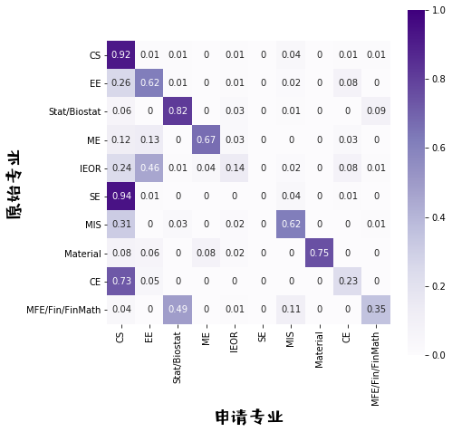


## 6.4 热门专业申请结果


```python
top10major_apply = descriptive.loc[descriptive['major_apply'].isin(top10mj_ap)]
top10major_offer = pd.crosstab(top10major_apply['major_apply'],top10major_apply['offertype'])
top10major_offer.plot.bar(stacked = True, cmap = "Set3")
```


    <matplotlib.axes._subplots.AxesSubplot at 0x1a295d05f8>


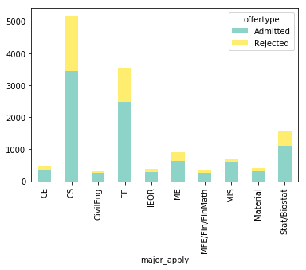


##  6.5 转专业申请成功率


```python
offertype2 = [1 if x == "Admitted" else 0 for x in descriptive['offertype'].values]
descriptive['offertype_onehot'] = offertype2
cross_offer_rate = descriptive.groupby(by = 'cross').agg({'offertype_onehot': "mean"})
cross_offer_rate.plot.bar(stacked = True, cmap = "Set3")
plt.xticks([0, 1],
  ['not switched', 'major switched'])
plt.ylim(0, 1)
plt.title('转专业 X 申请成功率',fontproperties=prop, fontsize=20)
plt.show()
plt.close()
```


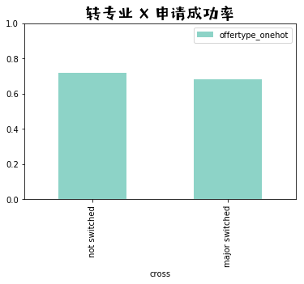


# 7. GRE

## 7.1 GRE成绩预处理


```python
### 7.1 GRE成绩预处理
## 转化为numeric型
gre_plot_dt=descriptive[['gre_total','gre_v','gre_q']]
descriptive['gre_v']=pd.to_numeric(gre_plot_dt['gre_v'],errors='coerce')
descriptive['gre_total']=pd.to_numeric(gre_plot_dt['gre_total'],errors='coerce')
descriptive['gre_q']=pd.to_numeric(gre_plot_dt['gre_q'],errors='coerce')
### 删去旧版gre verbal
descriptive=descriptive[descriptive['gre_total']<=340]

## 成绩分段
gre_total_dis=pd.cut(descriptive['gre_total'],
                    bins = [0, 315, 320, 325, 330, 350],   # 划分为5段
                     labels = ["<=315", "315-320", "320-325", "325-330", ">330"])
descriptive['gre_total_dis']=gre_total_dis
```

## 7.2 gre成绩与录取率


```python
## 计算录取率
gre_counts=pd.crosstab(descriptive['gre_total_dis'],descriptive['offertype'])
gre_pcts=gre_counts.div(gre_counts.sum(1),axis=0)
gre_pcts['Admitted'].plot.bar( cmap = "Set3")
plt.title("不同GRE成绩的平均录取率",fontproperties=prop, fontsize=20)
plt.show()
plt.close()
## gre成绩 x 申请学校排名 x 录取率
gre_college_counts=pd.crosstab([descriptive['gre_total_dis'],descriptive['CollegeRankTop50']],descriptive['offertype'])
gre_college_pcts=gre_college_counts.div(gre_college_counts.sum(1),axis=0)
gre_college_pcts1=pd.DataFrame(gre_college_pcts)
rownames2=gre_college_pcts1._stat_axis.values.tolist()
gre_college_pcts1=gre_college_pcts1.drop('Rejected',axis=1)
gre_college_pcts1['gre_total_dis']= [x[0] for x in rownames2]
gre_college_pcts1['CollegeRankTop50'] = [x[1] for x in rownames2]
gre_college_pcts2 = gre_college_pcts1.melt(
        id_vars=["gre_total_dis","CollegeRankTop50"],   #要保留的主字段
        value_name="ratio"                  # 拉长的度量值名称
        )
sns.catplot(x='gre_total_dis', y='ratio',  palette = "Pastel1", hue = 'CollegeRankTop50', kind='bar', data=gre_college_pcts2)
plt.title("GRE成绩 X 申请学校排名 -- 录取率",fontproperties=prop, fontsize=20)
plt.show()
plt.close()
```


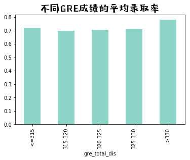


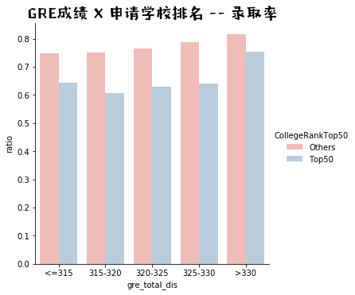


## 7.3 gre(verbal)、gre(quantitative)分数、学校排名与录取率


```python
## gre verbal 录取率
gre_v_dis=pd.cut(descriptive['gre_v'],   # 成绩分段（下同）
                 bins = [0,150,155,160,170],
                 labels =["<=150","150-155","155-160","160-170"])
gre_v_counts=pd.crosstab([gre_v_dis,descriptive['CollegeRankTop50']],descriptive['offertype'])
gre_v_pcts=gre_v_counts.div(gre_v_counts.sum(1),axis=0)
gre_v_pcts1=pd.DataFrame(gre_v_pcts)
rownames3=gre_v_pcts1._stat_axis.values.tolist()
gre_v_pcts1=gre_v_pcts1.drop('Rejected',axis=1)
gre_v_pcts1['gre_v_dis']= [x[0] for x in rownames3]
gre_v_pcts1['CollegeRankTop50'] = [x[1] for x in rownames3]
gre_v_pcts2 = gre_v_pcts1.melt(
        id_vars=["gre_v_dis","CollegeRankTop50"],   #要保留的主字段
        value_name="ratio"                  # 拉长的度量值名称
        )
sns.catplot(x='gre_v_dis', y='ratio', hue = 'CollegeRankTop50', kind='bar',
                palette = "Pastel1", data=gre_v_pcts2)
plt.title("GRE(verbal)成绩的平均录取率",fontproperties=prop, fontsize=20)
plt.show()
plt.close()
## gre quantitative 录取率
gre_q_dis=pd.cut(descriptive['gre_q'],   # 成绩分段（下同）
                 bins = [0,165,168,170],
                 labels =["<=165","165-168","168-170"])
gre_q_counts=pd.crosstab([gre_q_dis,descriptive['CollegeRankTop50']],descriptive['offertype'])
gre_q_pcts=gre_q_counts.div(gre_q_counts.sum(1),axis=0)
gre_q_pcts1=pd.DataFrame(gre_q_pcts)
rownames4=gre_q_pcts1._stat_axis.values.tolist()
gre_q_pcts1=gre_q_pcts1.drop('Rejected',axis=1)
gre_q_pcts1['gre_q_dis']= [x[0] for x in rownames4]
gre_q_pcts1['CollegeRankTop50'] = [x[1] for x in rownames4]
gre_q_pcts2 = gre_q_pcts1.melt(
        id_vars=["gre_q_dis","CollegeRankTop50"],   #要保留的主字段
        value_name="ratio"                  # 拉长的度量值名称
        )
sns.catplot(x='gre_q_dis', y='ratio', hue = 'CollegeRankTop50', kind='bar', 
                palette = "Pastel1", data=gre_q_pcts2)
plt.title("GRE(quantitative)成绩的平均录取率",fontproperties=prop, fontsize=20)
plt.show()
plt.close()
```


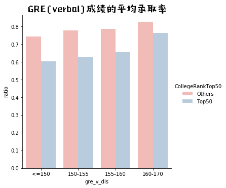


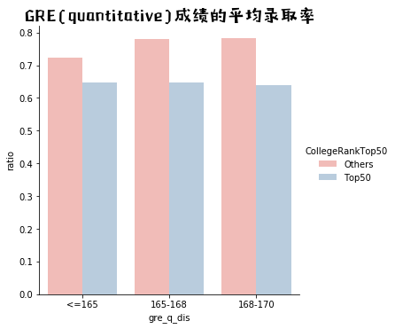


## 7.4 热门专业的GRE录取分数


```python
gre_admitted=descriptive[descriptive['offertype']=='Admitted']   ## 选出结果为录取的数据
top10mj_ap=['CS', 'EE', 'Stat/Biostat', 'ME', 'MIS', 'CE', 'Material', 'Other', 'IEOR', 'MFE/Fin/FinMath']
gre_top10mu_ap=gre_admitted[gre_admitted['major_apply'].isin(top10mj_ap)]
sns.catplot(x='major_apply',y='gre_total',kind='box', data=gre_top10mu_ap,
            height=5, aspect=2, palette="Pastel1")
plt.title("热门专业的GRE录取分数",fontproperties=prop, fontsize=20)
plt.show()
plt.close()
```


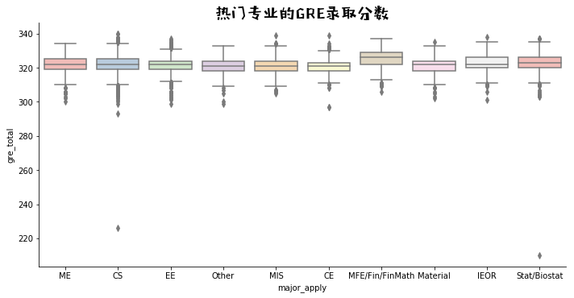


## 7.5 大学排名与GRE录取分数


```python
sns.catplot(x='CollegeRank',y='gre_total',kind='box',data=gre_top10mu_ap, palette="Pastel1")
plt.title("大学排名与GRE录取分数",fontproperties=prop, fontsize=20)
plt.show()
plt.close()
```


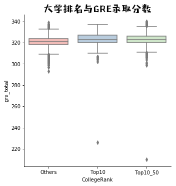


# 8.硬件条件


```python
descriptive['first'] = abs(descriptive['first'])
descriptive['sci'] = abs(descriptive['sci'])
```

## 8.1 学位 X 硬件条件比例  


```python
# 8.1 学位 X 硬件条件比例  
yingjian_type = descriptive.groupby(by = 'type').agg({'rl': "mean", 'intern': "mean",
                   'research': "mean",'paper': "mean",'first': "mean",
                   'sci': "mean",'exchange': "mean"})
fig = plt.figure(figsize=(7, 7))   # 画布
ax1 = fig.add_subplot(111)        # 创建子图
sns.heatmap(np.round(yingjian_type, 2).T, annot=True, vmax=0.5,vmin = 0, 
                square= True, cmap = "Purples")
ax1.set_yticklabels(labels = ["牛推","实习","科研","论文","一作","SCI","交流"], fontproperties=prop, fontsize=15)
ax1.set_xticklabels(labels = yingjian_type.index, fontproperties=prop, fontsize=15)
ax1.set_title('申请学位 X 硬件条件比例', fontproperties = prop, fontsize=20)
plt.show()
plt.close()
```


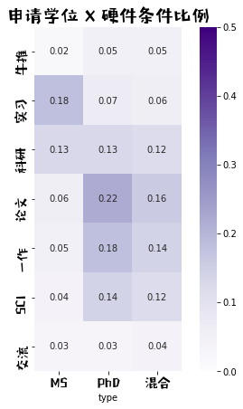


## 8.2 硬件条件  X 录取 （博士 or 硕士）


```python
# 博士
des_phd = descriptive[descriptive['type']=='PhD']   # 选出phd
yingjian_offer_phd = des_phd.groupby(by = 'offertype').agg({'rl': "mean", 'intern': "mean",
                   'research': "mean",'paper': "mean",'first': "mean",
                   'sci': "mean",'exchange': "mean"})
fig = plt.figure(figsize=(10, 6))   # 画布
ax1 = fig.add_subplot(121)        # 创建子图
sns.heatmap(np.round(yingjian_offer_phd, 2).T, annot=True, vmax=0.4,vmin = 0, 
                square= True, cmap = "Purples")
ax1.set_yticklabels(labels = ["牛推","实习","科研","论文","一作","SCI","交流"], fontproperties=prop, fontsize=15)
ax1.set_xticklabels(labels = ["录取","被拒"], fontproperties=prop, fontsize=15)
ax1.set_title('博士', fontproperties = prop, fontsize=15)

# 硕士
des_ms = descriptive[descriptive['type']=='MS']   # 选出phd
yingjian_offer_ms = des_ms.groupby(by = 'offertype').agg({'rl': "mean", 'intern': "mean",
                   'research': "mean",'paper': "mean",'first': "mean",
                   'sci': "mean",'exchange': "mean"})
ax2 = fig.add_subplot(122)        # 创建子图
sns.heatmap(np.round(yingjian_offer_ms, 2).T, annot=True, vmax=0.4,vmin = 0, 
                square= True, cmap = "Purples")
ax2.set_yticklabels(labels = ["牛推","实习","科研","论文","一作","SCI","交流"], fontproperties=prop, fontsize=15)
ax2.set_xticklabels(labels = ["录取","被拒"], fontproperties=prop, fontsize=15)
ax2.set_title('硕士', fontproperties = prop, fontsize=20)
plt.show()
plt.close()
```


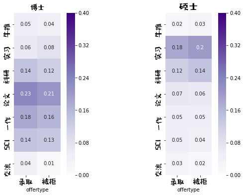


## 8.3 硬件条件 X 申请学校排名


```python
# 博士
des_admitted = descriptive[descriptive['offertype']=='Admitted']   # 选出被录取的
des_admitted_phd = des_admitted[des_admitted['type']=='PhD']   # 选出phd被录取的
yingjian_college_rank1 = des_admitted_phd.groupby(by = 'CollegeRank').agg({'rl': "mean", 'intern': "mean",
                   'research': "mean",'paper': "mean",'first': "mean",
                   'sci': "mean",'exchange': "mean"})
yingjian_college_rank1 = yingjian_college_rank1.reindex(["Top10","Top10_50","Others"],axis = 0)
fig = plt.figure(figsize=(10, 7))   # 画布
ax1 = fig.add_subplot(121)        # 创建子图
sns.heatmap(np.round(yingjian_college_rank1, 2).T, annot=True, vmax=0.4,vmin = 0, 
                square= True, cmap = "Purples")
ax1.set_yticklabels(labels = ["牛推","实习","科研","论文","一作","SCI","交流"], fontproperties=prop, fontsize=15)
ax1.set_xticklabels(labels = ["Top10","Top10~50","Others"], fontproperties=prop, fontsize=15)
ax1.set_title('博士', fontproperties = prop, fontsize=15)

# 硕士
des_admitted = descriptive[descriptive['offertype']=='Admitted']   # 选出被录取的
des_admitted_MS = des_admitted[des_admitted['type']=='MS']   # 选出ms录取的
yingjian_college_rank2 = des_admitted_MS.groupby(by = 'CollegeRank').agg({'rl': "mean", 'intern': "mean",
                   'research': "mean",'paper': "mean",'first': "mean",
                   'sci': "mean",'exchange': "mean"})
yingjian_college_rank2 = yingjian_college_rank2.reindex(["Top10","Top10_50","Others"],axis = 0)
ax2 = fig.add_subplot(122)        # 创建子图
sns.heatmap(np.round(yingjian_college_rank2, 2).T, annot=True, vmax=0.4,vmin = 0, 
                square= True, cmap = "Purples")
ax2.set_yticklabels(labels = ["牛推","实习","科研","论文","一作","SCI","交流"], fontproperties=prop, fontsize=15)
ax2.set_xticklabels(labels = ["Top10","Top10~50","Others"], fontproperties=prop, fontsize=15)
ax2.set_title('硕士', fontproperties = prop, fontsize=15)
plt.show()
plt.close()
```


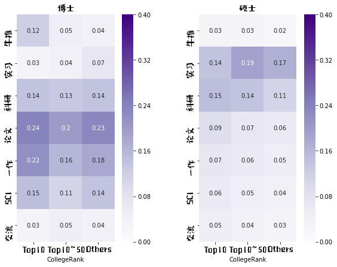

